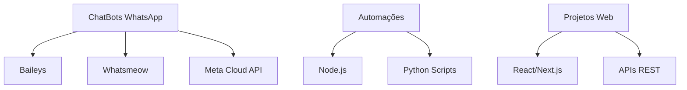

<div align="center">

# 👋 Olá, eu sou Ricardo Maminhak (CADÃO)


[](https://github.com/cadao7)

</div>

---

## 🚀 Sobre Mim

```javascript
const ricardo = {
    pronouns: "ele/him",
    location: "Brasil 🇧🇷",
    currentFocus: "ChatBots e Automações para WhatsApp",
    technologies: {
        backend: ["Node.js", "Python", "PHP"],
        frontend: ["React", "Next.js", "HTML/CSS"],
        mobile: ["React Native"],
        databases: ["MySQL", "PostgreSQL", "Redis", "Firebase", "SQLite"],
        tools: ["Docker", "Git", "Linux", "Windows Server"]
    },
    currentLearning: "Sempre explorando novas tecnologias...",
    funFact: "Quando não estou codando, provavelmente estou jogando Dota 2! 🎮"
};
```

## 🛠️ Tecnologias & Ferramentas

<div align="center">

### Frontend


### Backend


### Banco de Dados


### DevOps & Tools


</div>

## 🔭 Atualmente Trabalhando Em

<div align="center">



</div>

> 🤖 **Especialização**: Desenvolvimento de ChatBots e automações para WhatsApp usando tecnologias como Baileys, Whatsmeow e Meta Cloud API

## 📊 Estatísticas do GitHub

<div align="center">
  


</div>

> 💡 **Nota**: As estatísticas mostram apenas repositórios públicos. A maior parte do meu trabalho está em projetos privados!

<div align="center">

[](https://git.io/streak-stats)

</div>

## 🏆 Conquistas GitHub

<div align="center">


</div>

## 📈 Atividade de Contribuição

<div align="center">

[](https://github.com/ashutosh00710/github-readme-activity-graph)

</div>

## 💼 Portfólio & Contato

<div align="center">

### 📫 Entre em Contato

[](mailto:ricardo.maminhak@gmail.com)
[](https://sonho.digital)

### 🎯 Estatísticas do Repositório
```
📦 Total de Repositórios: 93
🔓 Públicos: 11  
🔒 Privados: 82
💼 Projetos Comerciais: Maioria privada por questões de confidencialidade
🏢 Trabalho: Foco em soluções corporativas e automações
```

</div>

---

<div align="center">

### 📖 Versículo do Dia

<div align="center">
  
</div>

<!-- Versículos rotativos - atualize manualmente quando quiser -->
<!-- Outras opções:
João 3:16 - "Porque Deus amou o mundo de tal maneira..."
Salmos 23:1 - "O Senhor é o meu pastor, nada me faltará"  
Provérbios 3:5-6 - "Confia no Senhor de todo o teu coração..."
Isaías 40:31 - "Os que esperam no Senhor renovam suas forças..."
-->

### 🎵 Spotify Playing

[](https://spotify-github-profile.vercel.app/api/view?uid=YOUR_SPOTIFY_ID&redirect=true)

---


*"Código limpo não é escrito seguindo regras. É escrito por um artesão que usa um conjunto equilibrado de disciplinas para criar uma obra de arte."* ✨

**⭐ From [cadao7](https://github.com/cadao7)**

</div>
